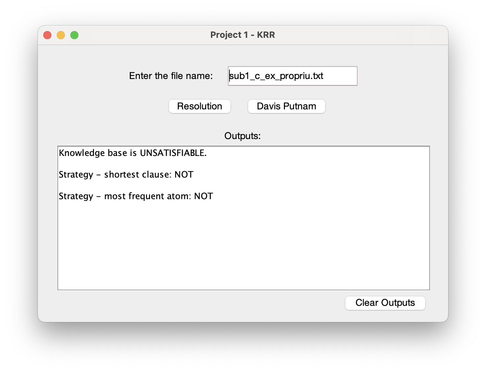
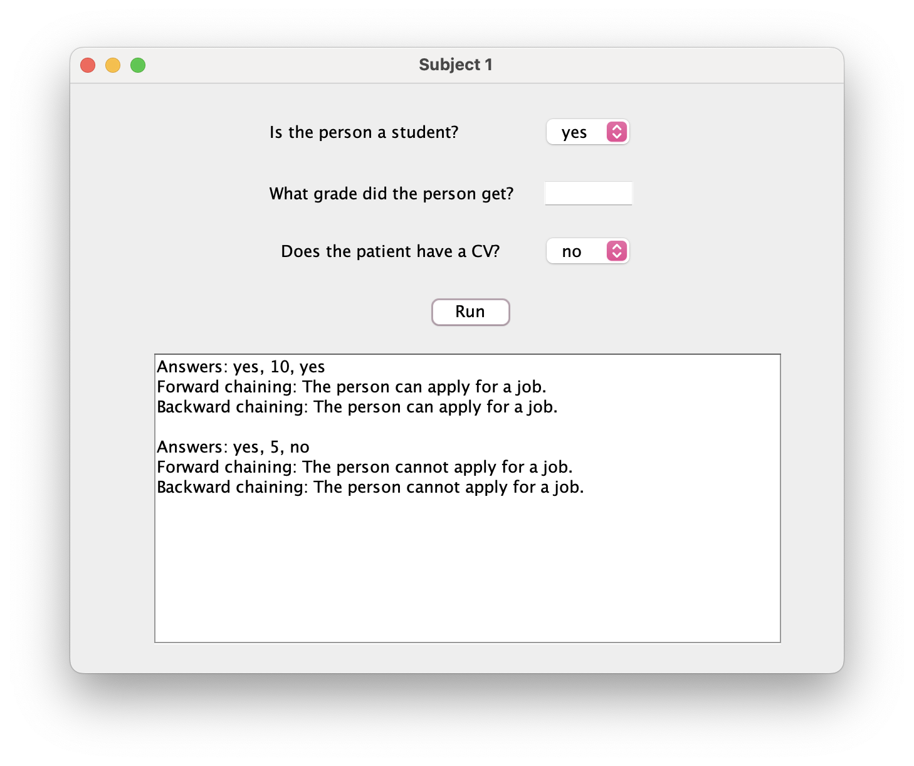
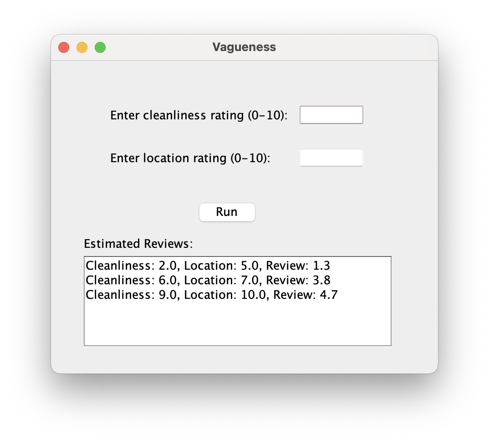

# Knowledge Representation and Reasoning Projects

This repository contains projects developed using **SWI-Prolog** and **Java graphical interfaces** for solving various knowledge representation and reasoning problems:

- **Resolution & SAT Solver:**  
  Implementation of Resolution in first-order logic and propositional logic, and the Davis-Putnam SAT-solving procedure.  
  <!--  -->

- **SLD Resolution (Forward & Backward):**  
  Forward and backward chaining resolution using Horn clauses.  
  <!--  -->

- **Vagueness & Degree Curves:**  
  Implementation illustrating vagueness in knowledge representation using degree curves.  
  <!--  -->

For details and running instructions, please visit each project's subfolder.

## References
- Ronald Brachman, Hector Levesque, *Knowledge Representation and Reasoning*, Morgan Kaufmann 2004.

