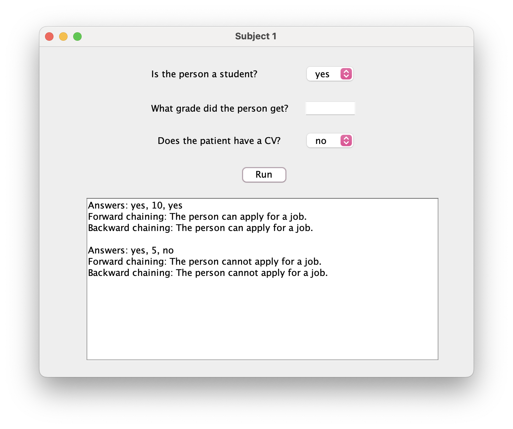

# SLD Resolution (Forward and Backward Chaining)

## Overview
This project demonstrates the use of **SLD resolution** (Selective Linear Definite clause resolution) on Horn clauses, implemented in SWI-Prolog with a Java graphical user interface. It applies two reasoning methods: **forward chaining** and **backward chaining**.

## Knowledge Base
The rules are represented using Horn clauses:

1. If a person is a student and has a grade greater than five, the person passes the exam.
2. If a person passes the exam, they receive a diploma.
3. If a person has a diploma and a CV, they can apply for a job.

In logical form:
```
KB = { [¬Student, ¬Grade, PassedExam],
       [¬PassedExam, Diploma],
       [¬Diploma, ¬CV, Job] }
```

**Goal:** Determine if the person can apply for a job (`Job`).

## How It Works
### Backward Chaining
Starting from the goal (`Job`), backward chaining breaks it into subgoals (`Diploma`, `PassedExam`, `Student`, `Grade`, `CV`) and recursively verifies if these are true based on user-provided inputs.

### Forward Chaining
Begins with facts (`Student`, `Grade`, `CV`) and derives new facts by repeatedly applying the rules until the goal (`Job`) is either reached or no further inference can be made.

## Running the Project
- Ensure SWI-Prolog and Java are installed.
- Run the Java graphical interface provided in the repository.
- Enter the required information (student status, grade obtained, and CV status).
- Select forward or backward chaining to derive the result.

## Example Usage
Input:
- Student: yes
- Grade: 7
- CV: yes

Output:
- Job: YES (the person can apply for a job)

## GUI Preview

